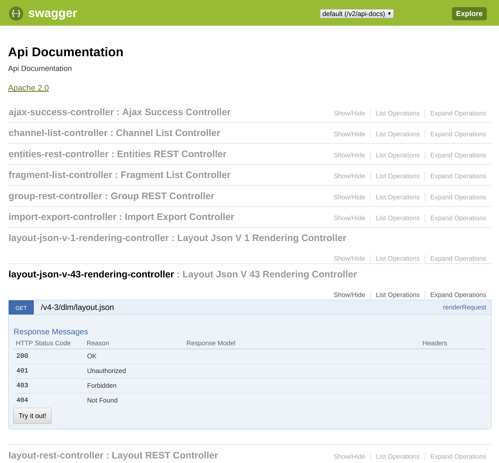

# API Documentation

## REST APIs

uPortal includes an extensive suite of REST APIs that it uses to access and manipulate portal data
from within the UI.  Swagger-based documentation and tooling is available for these APIs, but is
disabled (by default) as a security precaution.

To enable Swagger API documentation, add the following property to `uPortal.properties`:

```properties
org.apereo.portal.rest.swagger.SwaggerConfiguration.enabled=true
```

After restarting the Tomcat container, you can access the Swagger UI at `/uPortal/api/swagger-ui.html`.



### Single portlet JSON by fname

`/api/portlet/{fname}.json`

(example: `http://localhost:8080/uPortal/api/portlet/what-is-uportal.json` )

If the requesting user can `BROWSE` the portlet with the requested `fname`, responds with JSON 
representing the `portlet` with that fname. (Note structure in example below.)

Data elements:

Naming and describing the portlet:

 * `title`: End-user-facing name of the portlet. (Not to be confused with administrator-facing 
   `name`)
 * `fname`: technical unique-within-portal identifier for the portlet publication. Typically human 
   readable.
 * `description` : End-user-facing description of the portlet.
 * `iconUrl` : URL to an icon suitable for adorning or representing the portlet registrty entry.
 * `faIcon` : (may be null) identifier of a Font Awesome uicon suitable for adorning or representing
    the portlet registry entry.

About conveying arbitrary configuration:

 * `parameters` : a JavaScript map of name-value pairs representing the portlet publishing parameters
    of the portlet (since uPortal 5.2)

About escaping the portlet container:

 * `altMaxUrl` : (boolean) true if there is a URL to open in lieu of attempting to render the 
   portlet in the regular way. Useful for portlet registry entries that are lightweight stubs for 
   content external to the portlet container. 
 * `target` : (may be null) indicates what special target, if any, the `altMaxUrl` should open in,
    e.g. `_blank`

About enabling special handling in `uPortal-home`:

 * `widgetType`: (may be null) indicates a widget type, enabling re-using common widget 
   templates
 * `widgetTemplate`: (may be null) indicates a custom template for rendering the widget, used for
   the `custom` `widgetType`.
 * `widgetConfig`: (may be null) JSON configuration that informs the rendering of the widget type or
    custom widget template. This configuration is shared across all usages of the widget in a given 
    portlet definition.
 * `widgetURL` : (may be null) URL from which the browser should read additional JSON to inform the 
   rendering of the widget. Typically this JSON drives the dynamic portions of the custom widget 
   template or the widget type rendering.
 * `staticContent` : (may be null) the static HTML content associated with a simple Simple Content
   Portlet usage, suitable for direct client-side presentation to the user when attempting to render
   this portlet.
 * `pithyStaticContent` : (may be null) IN PRACTICE UNUSED.
 * `renderOnWeb` : (boolean) when true indicates the portlet is suitable for special rendering in
   `EXCLUSIVE` window state and then direct rendering the resulting markup by injecting it into the 
   DOM client-side rather than relying upon the full traditional XSLT rendering pipeline.

Data elements not understood offhand by the author of this documentation:

 * `nodeId` : (This is an opportunity to improve this documentation.)
 * `url` : ditto.

Example response:

```json
{
  "portlet": {
    "nodeId": "-1",
    "title": "Welcome to uPortal",
    "description": "Description of uPortal.",
    "url": null,
    "iconUrl": "/ResourceServingWebapp/rs/tango/0.8.90/32x32/mimetypes/text-html.png",
    "faIcon": null,
    "fname": "what-is-uportal",
    "target": null,
    "widgetURL": null,
    "widgetType": null,
    "widgetTemplate": null,
    "widgetConfig": null,
    "staticContent": "\n            \n                <h2>What is uPortal?</h2>\n                \n                <p>\n                    <a href=\"http://www.apereo.org/uportal\" target=\"_blank\">uPortal</a>\n                    is a free and open source Java-implemented web portal \n                    platform developed and maintained by participants drawn \n                    from across higher education under the coordination of \n                    <a href=\"http://www.apereo.org/\" target=\"_blank\">Apereo</a>.\n                    uPortal can aggregate content, present self-service \n                    applications, personalize presentation and content on the \n                    basis of groups and user attributes, drive mobile device applications, and allow advanced\n                    end-user-participatory customization of the portal experience. \n                    uPortal supports the JSR-286 and JSR-168 Java portlet specification for\n                    including your custom applications within the portal.\n                </p>\n                \n                <p>Welcome to uPortal.</p> \n            \n        ",
    "pithyStaticContent": null,
    "parameters": {
      "mobileIconUrl": "/uPortal/media/skins/icons/mobile/feedback.png",
      "iconUrl": "/ResourceServingWebapp/rs/tango/0.8.90/32x32/mimetypes/text-html.png",
      "disableDynamicTitle": "true",
      "configurable": "true"
    },
    "renderOnWeb": false,
    "altMaxUrl": false
  }
}
```
### Portlet Preferences

`/api/prefs/{task}`

(example: `http://localhost:8080/uPortal/api/prefs/getprefs/weather` )

These endpoints provide a way for soffits and web-components to access and store custom preferences for
individual soffits and web-components. There are several different endpoints for the various ways to store
and retrieve these preferences. This is an overview of the general uses. See the Swagger UI documentation 
for specifics of each endpoint. 

NOTE: to use any of these endpoints the soffit/web-component must know its own fname as registered in uPortal. 
This is essential to the functionality of the endpoints

#### Regular preferences vs default preferences

To access the regular (entity) preferences of an individual soffit or web-component use the endpoints with 
only prefs in the name. These will return or store the preferences associated with the specific user for the 
specific soffit/web-component. This will return/store the same information as the internal call to the preferences 
for portlets per entity.

NOTE: In order to protect unwanted meddling of portlet/soffit/web-component behavior, any preferences that you do not 
want changed must be declared as readonly when set at registration. Otherwise users can potentially override these 
settings for themselves. 

To access the default (definition) preferences of an individual soffit or web-component use the endpoints with 
definitionprefs in the name. These will return or store the preferences associated with the definition of the
specific soffit/web-component set when registered with uPortal. This will return/store the same information as 
the internal call to the preferences for portlets.
 
NOTE: These calls will be rejected if attempted by any user without administrative privileges. This prevents 
unauthorized meddling of default preferences since these calls can allow one to overwrite readonly preferences.

#### Only calls

There are two calls with only in their names. These are used to single out the preferences that are only associated 
with the called level without any extra. These are included because the normal retrieve calls return every preference 
up to the desired level, with any conflicting information overwritten by the higher level (just as the portlet calls do). 
If you wish to receive the preferences only associated with a specific level use these calls. 

NOTE: This may not return the preferences you expect. For example, any soffit calling the definitononly call will receive
the `org.apereo.portal.soffit.connector.SoffitConnectorController.serviceUrl` value and any soffit data model preferences 
as well as other definition preferences. 
Also be aware, if the user has no preferences set and you call entityonly you will receive an empty response body.  
