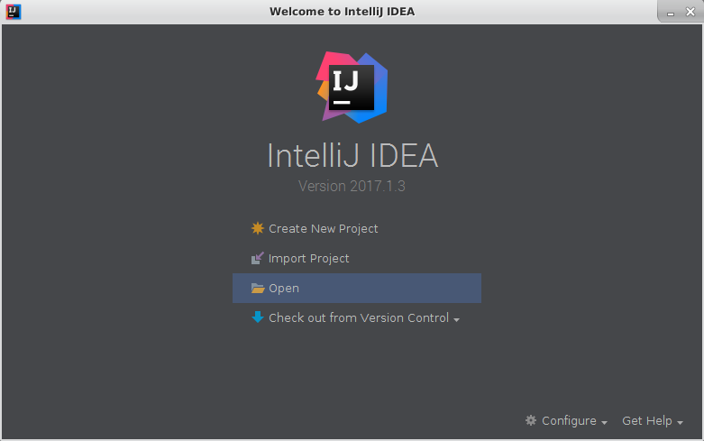
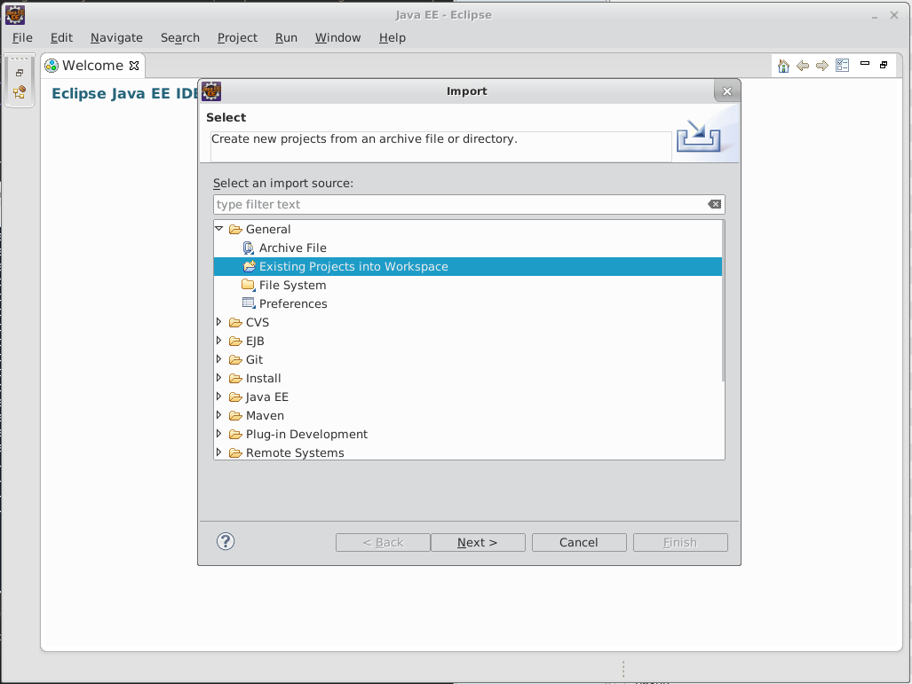

# IDE Integration

These scripts automatically generate project configuration for the Intellij and Eclipse editors.
Using these scripts removes the need to run custom import and configuration to integrate uPortal with the Integrated Development Environment (IDE).

## Intellij

1. Open a terminal
2. `cd` to the uPortal folder
3. run
```sh
./gradlew idea
```
4. Open intellij
5. Go to the welcome page
6. Select open

7. Navigate to the uPortal folder
8. Open it

## Eclipse

1. Open a terminal
2. `cd` to the uPortal folder
3. run
```sh
./gradlew eclipse
```
4. Open eclipse
5. Select file > import
6. Search for "Existing Projects into Workspace"

7. Select the the uPortal folder as root directory
8. Select the "Search for nested projects" option
8. Open it
