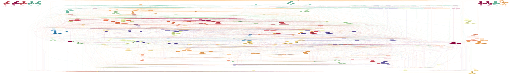
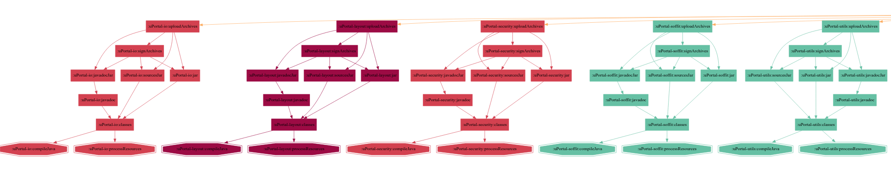
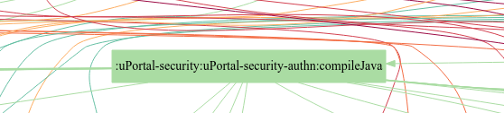

# Architecture

## Structure de Build

uPortal exploite [Gradle][] pour la gestion du build et des packages.
Gradle divise le travail nécessaire pour construire le portail en [projects et tasks][].
Chaque groupement logique de code dans le portail est son propre sous-projet, et chaque sous-projet a un graph de tâches.
Chaque tâche est reliée au travail (d'autres tasks) dont elle dépend, pour fonctionner.

La vue la plus complète du graph de tâches et de la structure de dépendance du build provient de la tâche `gradle release`, voir ci-dessous.

Certaines caractéristiques architecturales intéressantes peuvent être extraites du graph général de tâche.

### Couplage de code

:note: N.B. Les tâches JavaDoc ont tendance à être fortement liées entre elles, cependant des liaisons croisées sur la JavaDoc ne signalent pas nécessairement un couplage étroit.

#### Couplage lâche

Les sous-projets faiblement couplés resteront généralement groupés dans le graph des tâches, avec des liens limités vers d'autres sous-projets.
Par exemple: les cinq sous-projets présentés ci-dessous sont complètement découplés.

:note: N.B. Les tâches JavaDoc ont tendance à être fortement liées entre elles, mais des liaisons croisées dans la JavaDoc ne signalent pas nécessairement un couplage étroit.

#### Couplage étroit

Les projets avec un couplage édroit tendent à être tirés vers le centre du graphe et ont de nombreuses lignes qui sortent de leur tâche `compileJava`.
Les projets qui ont de nombreuses dépendances apparaîtront vers le haut du graph, les projets fortement dépendants vers le bas.
Par exemple: le sous-projet `uPortal-security/uPortal-security-authn` dépend de 23 autres sous-projets.

[Gradle]: https://gradle.org
[projects et tasks]: https://docs.gradle.org/current/userguide/tutorial_using_tasks.html
