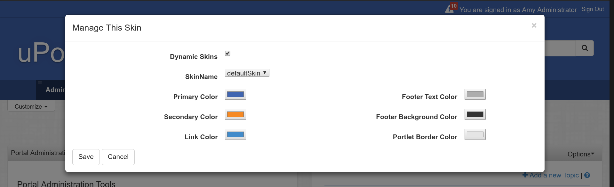
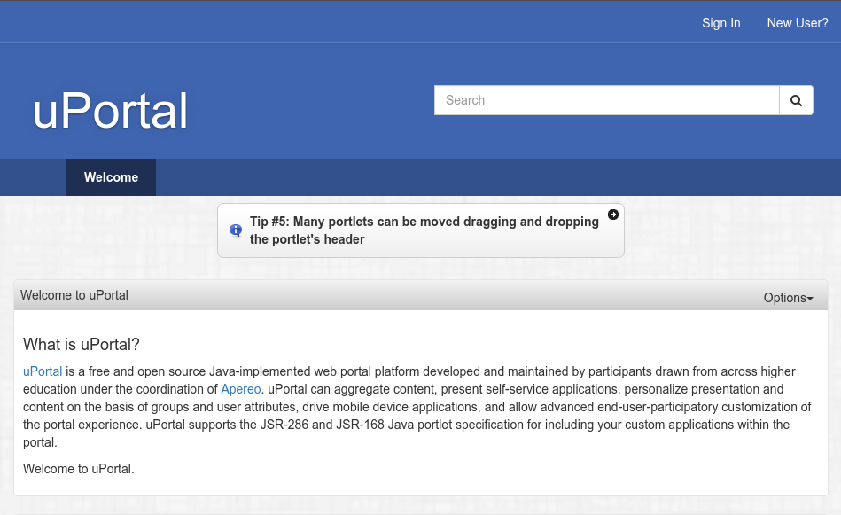

# Skin uPortal

## Table des matières

1.  [Créer une Skin](#créer-une-skin)
2.  [Configuration du Skin](#configuration-du-skin)
3.  [Notes additionnelles](#notes-additionnelles)
    1.  [Dynamic Respondr Skin](#dynamic-respondr-skin)
    2.  [Effets de Page](#effets-de-page)

## Créer une Skin

1. Commencer par le dossier racine du code source uPortal
2. Accéder au dossier *uportal-war/src/main/webapp/media/skins*
3. Copier le dossier *defaultSkin/* et attribuez-lui un nom spécifique à votre institution (par exemple *wolverine/*)
4. Copier le fichier *defaultSkin.less* et attribuez-lui le même nom (par exemple, *wolverine.less*)
5. Modifier les imports dans le fichier de Skin pour pointer vers le dossier de skin. par exemple. *wolverine.less*

    ``` less
    /** DO NOT REMOVE OR ALTER THESE INCLUDES **/
    @import "defaultSkin/less/variables.less";
    @import "common/common.less";
    /*******************************************/

    @import "wolverine/less/variables.less";
    @import "wolverine/less/skin.less";
    ```

6. Accéder au dossier *uportal-war/src/main/webapp/media/skins/respondr*
7. Éditer *skinList.xml* pour pointer les noms `<skin-name>` et `<skin-key>` vers le nouveau nom de skin. Par exemple.

    ``` xml
    <skin>
        <skin-key>wolverine</skin-key>
        <skin-name>wolverine</skin-name>
        <skin-description>
            Basic skin for the Respondr theme based on Twitter Bootstrap and Responsive Design
        </skin-description>
    </skin>
    ```

8.  Accéder au dossier *uportal-war/src/main/data/default_entities/portlet-definition*
9.  Éditer *dynamic-respondr-skin.portlet-definition.xml* et ajouter une `<portal-preference>` avec un `<name>` de `PREFdynamicSkinName` et une `<value>` avec le nom de la Skin. Par exemple.

    ``` xml
    <portlet-preference>
        <name>PREFdynamicSkinName</name>
        <value>wolverine</value>
    </portlet-preference>
    ```

10. Accéder au dossier *uportal-war/src/main/data/required_entities/stylesheet-descriptor*
11. Éditer *Respondr.stylesheet-descriptor.xml* et changer la `<default-value>` pour le nom de la Skin. Par exemple. 

    ``` xml
    <stylesheet-parameter>
        <name>skin</name>
        <default-value>wolverine</default-value>
        <scope>PERSISTENT</scope>
        <description>Skin name</description>
    </stylesheet-parameter>
    ```

12. Lancer `ant initdb` pour appliquer ces changements en base.
13. Lancer `ant clean deploy-war` pour lancer un Build du portail avec la nouvelle Skin.
14. **Ne pas oublier d'ajouter la Skin à Git!**

## Configuration du Skin

uPortal utilise des [variables Less](http://lesscss.org/features/#variables-feature) pour gérer les changements globaux de Skin.
Des Changements peuvent être fait pour surcharger les [variables Bootstrap](/uportal-war/src/main/webapp/media/skins/respondr/common/bootstrap/variables.less) ou les [variables uPortal](/uportal-war/src/main/webapp/media/skins/respondr/defaultSkin/less/variables.less), les changements devraient surtout être fait au niveau du fichier `variable.less`.

## Notes additionnelles

### Dynamic Respondr Skin

Les variables de `@color` 1-6 sont des valeurs personnalisables via la portlet dynamic respondr skin.

``` less
@color1
@color2
@color3
@color4
@color5
@color6
```



### Skin par défaut

**Sélectionner un skin par défaut basé sur les attributs utilisateur peut être réalisé en suivant ces étapes:**
Tous les bean doivent être créé dans un fichier sous *uPortal-webapp/src/main/resources/properties/contextOverrides/\*.xml*

***1. Créer un bean associé à un attribut utilisateur*** 
```xml 
 <bean id="customskinServerName" class="org.apereo.portal.rendering.xslt.UserAttributeSkinMappingTransformerConfigurationSource">
    <property name="stylesheetDescriptorNames">
      <set>
        <value>Respondr</value>
      </set>
    </property>
    <property name="skinAttributeName" value="serverName" />
    <property name="attributeToSkinMap">
        <map>
            <entry key=".*\.example\.com" value="example.com" />
        </map>
    </property>
</bean>
```
***2. Indiquer la feuille de style sur laquelle l'appliquer***

Indiquer toutes les feuilles de style dans `stylesheetDescriptorNames` sur lesquelles appliquer l'association via la balise `<value></value>`.
***3. Indiquer l'attribut utilisateur à utiliser***

Modifier `<property name="skinAttributeName" value="serverName" />` changer la valeur pour le nom de l'attribut utilisateur sur lequel baser le choix du skin.
***4. Associer une valeur modèle à un nom de skin***
 
Ajouter une `<entry key=".*\.example\.com" value="example.com" />` dans la propriété `attributeToSkinMap` pour chaque skin à associer. La clé est un modèle d'expression régulière, la valeur est le nom du skin à associer sir le modèle correspond.


**Pour sélectionner un skin de défaut basé sur un groupe utilisateur il sera nécessaire d'utiliser un bean de ce type**

```xml
  <bean class="org.apereo.portal.rendering.xslt.UserGroupSkinMappingTransformerConfigurationSource">
    <property name="stylesheetDescriptorNames">
        <set>
          <value>Respondr</value>
        </set>
    </property>
    <property name="groupToSkinMap">
        <map>
            <entry key="pags.studends" value="students" />
            <entry key="pags.staff" value="staff" />
            <entry key="pags.faculty" value="staff" />
        </map>
    </property>
  </bean>
```
*Associer un groupe à un skin*

Ajouter une `<entry key="pags.faculty" value="staff" />` dans la propriété `groupToSkinMap` pour chaque skin à associer. La clé est une cle d'un groupe uPortal, qualifiée avec le nom du `Group Store`, la valeur est le nom du skin a associer si l'utilisateur est membre (direct ou d'un sous-groupe) du groupe.

**Vous pouvez réperter ces étapes afin d'avoir plusieurs bean permettant d'associer vos skin sur différents critères**

**Dernière étape**
Pour appliquer la personnalisation créer un bean pour référencer l'ensemble des bean et les intégrer au processus de `renderingPipeline` :
```xml
  <util:list id="customSkinsTransformers">
    <ref bean="guestskinTransformer"/>
    <ref bean="defaultskinTransformer"/>
    <ref bean="agriSkinTransformer"/>
  </util:list>
```
- L'id ne doit pas être modifié car il permet de surcharger la configuration par défaut qui est vide
- Ajouter tous vos bean créés et référencés (Ils doiven,t avoir un ID unique) avec `<ref bean="ID"/>`
- L'ordre est important car la propriété du nom du skin sera surchargée par chaque bean défini, l'ordre appliqué sera le même que leur position dans ce bean. 
 

### Effets de Page

La couleur de fond et l'image de fond du portail peuvent recevoir des effets spéciaux.
Modifier `@portal-page-body-background-image-filter` permet toutes les combinaisons possible de [filtres css](https://developer.mozilla.org/en-US/docs/Web/CSS/filter) d'être appliqué.




